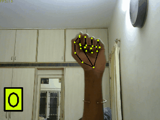

# GESTURE DETECTION/RECOGNITION WITH MEDIAPIPE

 Recognises the number of fingers opened using the hands solution in the mediapipe library by google without using tensorflow in python. 
 This is the simplest way in which this can be done 

